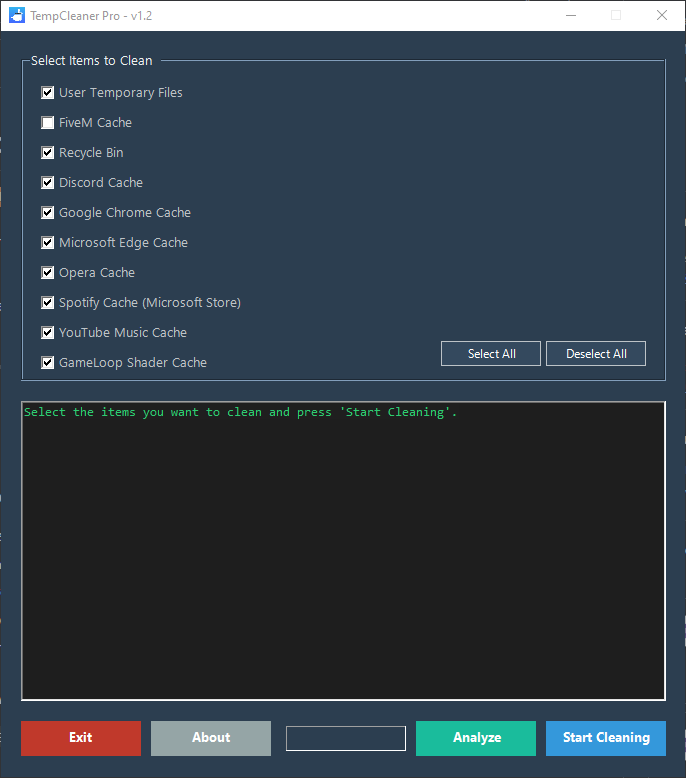

# TempCleaner Pro v1.2

Kullanıcı dostu arayüzü ile sisteminizdeki geçici dosyaları, önbellekleri ve gereksiz verileri temizlemek için geliştirilmiş güçlü bir Windows aracı.

**English:** A user-friendly tool with a graphical interface for cleaning temporary files, caches, and other junk data from your Windows system.

---

### Tanıtım (Demo)

### 📝 Öne Çıkan Özellikler (Features)

*   **Analiz Modu:** Silme işleminden önce ne kadar alan kazanacağınızı raporlar.
*   **Gerçek Zamanlı Raporlama:** Yapılan tüm işlemleri anlık olarak detaylı bir şekilde gösterir.
*   **Modern Arayüz:** Koyu tema ve anlaşılır kontroller ile kolay kullanım sunar.
*   **Geniş Kapsamlı Temizlik:** Popüler uygulamaları ve kritik sistem alanlarını hedefler.
*   **Taşınabilir (Portable):** Kurulum gerektirmez, doğrudan çalışır.

### 🧹 Desteklenen Temizlik Alanları (Supported Cleaning Locations)

*   Kullanıcı Geçici Dosyaları (`%TEMP%`)
*   Geri Dönüşüm Kutusu
*   **Tarayıcı Önbellekleri:**
    *   Google Chrome
    *   Microsoft Edge
    *   Opera
*   **Uygulama Önbellekleri:**
    *   Discord
    *   FiveM
    *   Spotify (Microsoft Store Sürümü)
    *   YouTube Music
    *   GameLoop (Shader Cache)

### 🚀 Kullanım (Usage)

Program kurulum gerektirmez.

1.  Projenin [**Releases**](https://github.com/huseyinkocanli/TempCleanerPro/releases) (Yayınlar) sayfasından en son `.zip` dosyasını indirin.
2.  İndirdiğiniz arşivi istediğiniz bir klasöre çıkartın.
3.  `TempCleanerLauncher.exe` dosyasına çift tıklayarak programı çalıştırın.

⚠️ **Önemli:** Programın doğru çalışması için `TempCleanerLauncher.exe`, `TempCleaner.ps1` ve `TempCleaner.ico` dosyaları her zaman aynı klasörde bulunmalıdır.

### 🛠️ Kaynaktan Derleme (Building from Source)

Projeyi kendiniz derlemek isterseniz:

*   **Gereksinim:** [Visual Studio](https://visualstudio.microsoft.com/) (".NET masaüstü geliştirme" iş yükü yüklenmiş olmalıdır).
*   **Adımlar:**
    1.  Bu repoyu klonlayın: `git clone https://github.com/huseyinkocanli/TempCleanerPro.git`
    2.  `TempCleanerLauncher.sln` dosyasını Visual Studio ile açın.
    3.  Derleme modunu `Debug` yerine `Release` olarak ayarlayın.
    4.  Menüden `Build > Build Solution` seçeneğine tıklayın.
    5.  Çalıştırılabilir dosya `bin\Release` klasöründe oluşturulacaktır.

### 💻 Teknoloji Mimarisi (Tech Stack)

*   **PowerShell:** Programın tüm temizlik mantığı ve grafiksel arayüzü (GUI) WinForms kullanılarak PowerShell ile yazılmıştır.
*   **C#:** PowerShell betiğini başlatan ve konsol penceresini gizleyen `.exe` başlatıcı (launcher) C# ile yazılmıştır.
*   **.NET Framework 4.7.2:** Projenin hedeflediği framework sürümüdür.
*   **Visual Studio:** Projenin geliştirildiği ana IDE'dir.

### 👤 Yazar (Author)

**Hüseyin Kocanlı** (Thekocanl)

*   **GitHub:** [@huseyinkocanli](https://github.com/huseyinkocanli)

### 📄 Lisans (License)

Bu proje MIT Lisansı altında lisanslanmıştır. Detaylar için `LICENSE` dosyasına göz atın.